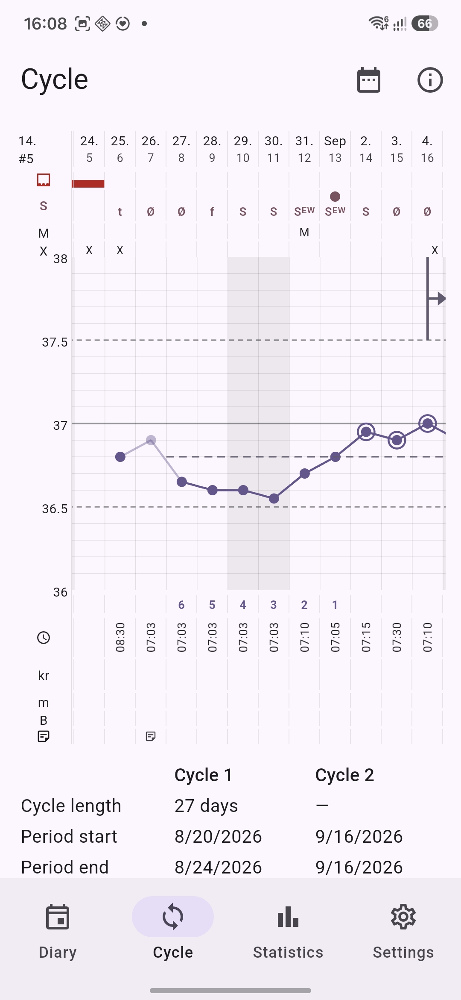
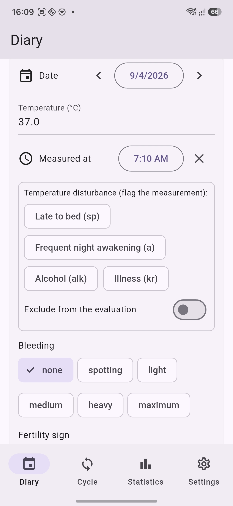

# NER Cycle App (Arbeitstitel)

[](https://github.com/BenediktBurger/cycle-app/releases)
[](https://github.com/BenediktBurger/cycle-app/actions/workflows/ci.yml)

<p align="center">
  
</p>

---

## What it is

A local-first, open-source mobile app (Android + iOS, PWA bonus) for
tracking menstrual-cycle symptoms and manually evaluating them per **NER
rules (Rötzer), in the INER spirit**: the app computes and visualizes, the
user stays the decision-maker. The full posture is described in
[docs/product/vision.md](docs/product/vision.md) and
[ADR-0001](docs/adr/0001-iner-mode-m-hypothesis.md).

> **This app is in beta.** A beta can still lose data, so export your data
> **regularly and before every update** — via Export in the settings
> screen. See [Backup, migration & recovery](#backup-migration--recovery).

## Screenshots

The current app — cycle chart and diary, shown in English to match the
en-US store listing:

<p align="center">
  
  
</p>

## Installation (Android)

Install the app on an **Android** device — no Flutter SDK, no development
setup needed. (An iOS build does not exist yet.) The app is fully offline:
no network access, no analytics; all data stays on your device.

### Where to get it

Download an APK from the
[GitHub releases page](https://github.com/BenediktBurger/cycle-app/releases).
Each release carries three release-signed APKs — one per device
architecture (ABI), named `cycle-app-<version>-<abi>.apk` where `<version>`
is the release's version number, e.g. `cycle-app-0.2.0-arm64-v8a.apk`. Pick
the one matching your phone:

- `cycle-app-<version>-arm64-v8a.apk` — modern phones (the right choice for
  most devices),
- `cycle-app-<version>-armeabi-v7a.apk` — older 32-bit devices,
- `cycle-app-<version>-x86_64.apk` — mainly emulators.

Not sure which? Check *Settings → About phone* for the processor
information, or — with the phone connected to a computer and
developer options enabled — run `adb shell getprop ro.product.cpu.abi`.
All three APKs are signed with the same release key. Every release note
lists each APK's SHA-256 checksum plus the signing certificate's SHA-256
fingerprint, so you can verify the download if you want to.

### Installing

1. Download the APK matching your device (see above) from the latest
   release.
2. Open the downloaded file on the device.
3. Android will warn about installing apps from an external source
   (sideloading / "unknown sources") — accept it to continue.
4. Expect an additional "unknown developer" / "unsafe app" style
   Play-Protect remark: the app is signed with the project's own key and is
   not distributed through a store. This is expected, not a sign that
   something is wrong with the file.

### Updating

Download the most recent APK for your device's architecture (the same one
you installed before) from the releases page and install it over the
existing version. Because the signing certificate stays the same, Android
updates the app in place instead of treating it as a new install, and your
data stays. Export your data first anyway (Export in the settings screen —
see [Backup, migration & recovery](#backup-migration--recovery)).

## Web demo

There is also a public web demo at
[BenediktBurger.github.io/cycle-app](https://BenediktBurger.github.io/cycle-app/):
the app running in your browser, nothing to install. The demo is built from
the current development state, so it shows the upcoming release rather than
the latest published one. Entries made there stay in that browser — the
browser storage is not encrypted. The
[demo page](https://BenediktBurger.github.io/cycle-app/) states the
details.

## Example data

Sample files in [`examples/`](examples/README.md) — in the app's JSON
export format and some in the drip CSV format — can be loaded into the app
or the web demo for a first look. Both import paths merge by date with an
overwrite policy, so don't import into a profile with real data without
exporting first.

## Import from drip

The settings screen can import a **CSV export of the drip cycle tracker**
(a sibling project): paste it anywhere (a file picker is offered on the
web). Rows merge into the main profile by date, with the same
overwrite-by-date policy as the JSON import. The mucus texture nuances are
lost, and symptom details without a stored field (the mucus, cervix, and
bleeding exclude flags) fold into the day's note instead. The full
per-day mapping, the merge policy, and the open expert-review items are in
[docs/drip-import.md](docs/drip-import.md).

## Backup, migration & recovery

Backup, data migration to another device, and data recovery all happen
through **Export and Import in the Einstellungen (settings) pane — and
nowhere else**:

- Export regularly to a file you control (Einstellungen › Export) and
  import it on the target device to restore/re-migrate your data there.
- **Never copy the database file itself** (Android/iOS): there the database
  is encrypted with a device-bound key (see
  [ADR-0005](docs/adr/0005-storage-and-encryption.md)), so a copied file is
  unopenable data on anything else — not a backup.
- On the **web build** the browser storage (OPFS/IndexedDB) is not encrypted
  by the app (web stays an unencrypted development tool) — the public
  [web demo](https://BenediktBurger.github.io/cycle-app/) states what that
  means for demo users.

Export/import is the only backup path on **all** platforms — web
included.

## Feedback

Found an issue or have a suggestion? Please open an issue at
[github.com/BenediktBurger/cycle-app/issues](https://github.com/BenediktBurger/cycle-app/issues)
— feedback is very welcome.

## Installation (Deutsch)

Deutsche Fassung des Wichtigsten für deutschsprachige Nutzer —
Installationsweg, Beta-Hinweis, Aktualisierung, Beispieldaten, Feedback.
Einzelheiten zur Sicherung:
[Backup, migration & recovery](#backup-migration--recovery) (auf Englisch).

Die App unterstützt die Beobachtung des Zyklus: Sie erfassen jeden Tag Ihre
Daten, und die App rechnet und zeigt an — sie schlägt nichts vor und
entscheidet nichts. Methodenkenntnisse (aus einem Lehrbuch oder einer
Schulung) sind Voraussetzung für eine zuverlässige Beurteilung.

**Beta-Hinweis:** Die App befindet sich in der Beta-Phase — Datenverlust
ist nicht ausgeschlossen. Exportieren Sie Ihre Daten deshalb **regelmäßig
und vor jedem Update** über den Export in den Einstellungen; der Export ist
auf allen Plattformen der einzige Backup-Weg (Einzelheiten:
[Backup, migration & recovery](#backup-migration--recovery)).

**Installation (Android):** Eine iOS-Version gibt es noch nicht.

1. Laden Sie die zu Ihrem Gerät passende APK von der
   [GitHub-Releases-Seite](https://github.com/BenediktBurger/cycle-app/releases)
   herunter. Jedes Release enthält drei APKs — eine pro Gerätearchitektur:

   - `cycle-app-<version>-arm64-v8a.apk` — moderne Telefone (die richtige
     Wahl für die meisten Geräte),
   - `cycle-app-<version>-armeabi-v7a.apk` — ältere 32-Bit-Geräte,
   - `cycle-app-<version>-x86_64.apk` — hauptsächlich Emulatoren.

2. Öffnen Sie die heruntergeladene Datei auf dem Gerät und bestätigen Sie
   die Warnung zum Installieren aus einer externen Quelle (Sideload /
   „unbekannte Quellen“).
3. Ein zusätzlicher Play-Protect-Hinweis („unbekannter Entwickler“) ist zu
   erwarten: Die App ist mit dem eigenen Schlüssel des Projekts signiert
   und wird über keinen Store verteilt — das ist normal und kein Zeichen
   für ein Problem.

Beispieldaten zum Ausprobieren finden Sie unter
[`examples/`](examples/README.md) (auf Englisch).

### Aktualisierung

Laden Sie die neueste APK für dieselbe Architektur herunter und
installieren Sie sie über die bestehende Version. Da der
Signaturschlüssel gleich bleibt, wird die App an Ort und Stelle
aktualisiert und Ihre Daten bleiben erhalten — aber: exportieren Sie
vorher (siehe Beta-Hinweis oben).

Fehler gefunden oder Verbesserungsvorschlag? Bitte öffnen Sie ein Issue auf
[GitHub](https://github.com/BenediktBurger/cycle-app/issues).

## For developers

### Getting started

```sh
flutter pub get
flutter run -d chrome
```

Requires a Flutter stable SDK (any location with `<sdk>/bin` on PATH). See
[CONTRIBUTING.md](CONTRIBUTING.md) for the full setup, platform
scaffolding, and the analyze/test/build commands — notably
`flutter pub get` before `flutter test`.

### Tech stack

- **Flutter** stable (web as iteration target, per
  [ADR-0003](docs/adr/0003-target-platforms-web-iteration.md); product
  targets Android + iOS)
- **flutter_riverpod** for state management
  ([ADR-0004](docs/adr/0004-riverpod-flchart-flutter.md))
- **drift / SQLite** for local-first storage
  ([ADR-0005](docs/adr/0005-storage-and-encryption.md))
- **`flutter gen-l10n`** for localization, German-first with English mirrored

### Project layout / docs

- [docs/product/vision.md](docs/product/vision.md) — product vision and
  requirements.
- [docs/adr/README.md](docs/adr/README.md) — architecture decision records
  (ADR-0001 … ADR-0007 — 0007 is the language policy).
- [docs/dev-notes.md](docs/dev-notes.md) — operational lessons and how-tos.
- [docs/roadmap.md](docs/roadmap.md) — open work / upcoming milestones
  (to-do list; history lives in git).
- `.github/workflows/ci.yml` — GitHub Actions CI: `flutter analyze`,
  `flutter test`, `flutter build web` (ADR-0006).

### Status

Working app: Tagebuch / Zyklus / Statistik / Einstellungen on a local drift
database, with JSON export/import; the UI is German-first with an English
switch, including the Mode-M marking UI (first higher measurement, mucus
peak, SUZ). Open work is tracked in [docs/roadmap.md](docs/roadmap.md).

## License

**Apache-2.0**: the full text is in the [`LICENSE`](LICENSE) file at the
repo root. (The final license confirmation before the first published
release is still open.)

One shipped asset carries its own license: the bundled Noto Sans Regular
font (used by the PDF export so note text renders beyond Latin-1) is
licensed under the SIL Open Font License 1.1 — see
`assets/fonts/LICENSE-NotoSans.txt`.
